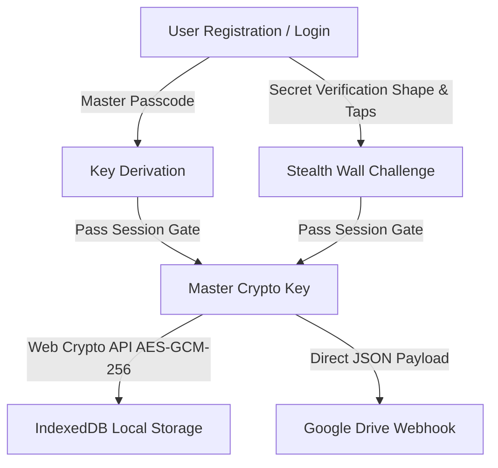

# 🔐 GNOTED

> **A Privacy-First, Zero-Knowledge Encrypted Vault & Task Manager featuring Custom Secret Shape Verification, Client-Side AES-GCM Encryption, Task Deadline Reminders, and Direct Google Drive Webhook Automated Sync.**


---

## 🌟 Overview

**GNOTED** is a high-contrast, security-focused Progressive Web Application (PWA) designed for storing confidential notes, passwords, private keys, and scheduled tasks. 

All sensitive data is encrypted locally using the **Web Crypto API (AES-GCM 256-bit)** before persistent storage in IndexedDB. Authentication uses a 2-step verification system: passcode unlock followed by a stealth secret shape wallpaper challenge where the secret shape must be tapped a set consecutive number of times.

---

## ✨ Key Features

- 🛡️ **Zero-Knowledge AES-GCM Encryption**: All note titles, contents, and task items are encrypted on the client side using Web Crypto API.
- 🎨 **High Contrast Amber Theme**: Pitch black backdrop (`#08080A`), dark charcoal card containers (`#111216`), crisp white text (`#FFFFFF`), and vivid Amber Yellow accents (`#F59E0B`).
- 🔷 **Secret Shape Verification Challenge**: Custom verification gate requiring sequential taps on your secret shape.
- 📋 **Auto-Sensitive Categories**: `Passwords` and `Private Keys` categories automatically mask content for extra privacy.
- ⏱️ **Task Deadline Reminders**: Priority tasks (`Urgent`, `Important`, `Neutral`, `Someday`) with customizable due dates and browser notifications.
- ☁️ **Automated Google Drive Webhook Integration**: Directly sync encrypted JSON note backups to your personal Google Drive folder using a zero-cost Google Apps Script Webhook.
- 📦 **Offline-First PWA**: Fully functional offline powered by Service Workers and IndexedDB storage.
- 📁 **Encrypted Backup Export & Import**: Easy local encrypted data backup and restoration.

---

## 🌐 Google Drive Webhook Setup Guide

### Why is a Webhook Needed?

Google Drive API usually requires complex server backends, OAuth2 authentication screens, and client secrets. 

By using a **Google Apps Script Webhook**:
1. **$0.00 Cost**: Free for all personal `@gmail.com` accounts.
2. **Zero Middleman**: Webhook requests travel directly from your browser to your personal Google Drive space via Google's infrastructure.
3. **No OAuth Complexity**: You deploy the script under your own Google account, granting it permission to write directly to your Drive folder.

---

### Step-by-Step Webhook Creation

#### Step 1: Open Google Apps Script
Go to [script.google.com](https://script.google.com) and log in with your Google account. Click **New Project**.

#### Step 2: Paste the Apps Script Code
Replace all default code in `Code.gs` with the following snippet:

```javascript
function doPost(e) {
  try {
    var contents = e.postData.contents;
    var data = JSON.parse(contents);
    
    var filename = data.filename || ("gnoted_backup_" + new Date().getTime() + ".json");
    var payloadStr = data.payload || "";
    var targetFolderId = data.folderId || "";
    
    var folder;
    if (targetFolderId && targetFolderId.trim().length > 5) {
      try {
        folder = DriveApp.getFolderById(targetFolderId.trim());
      } catch (err) {
        folder = DriveApp.getRootFolder();
      }
    } else {
      folder = DriveApp.getRootFolder();
    }
    
    // Create the file in the designated Google Drive folder
    var file = folder.createFile(filename, payloadStr, MimeType.PLAIN_TEXT);
    
    return ContentService
      .createTextOutput(JSON.stringify({ result: "success", fileId: file.getId(), url: file.getUrl() }))
      .setMimeType(ContentService.MimeType.JSON);
  } catch (error) {
    return ContentService
      .createTextOutput(JSON.stringify({ result: "error", message: error.toString() }))
      .setMimeType(ContentService.MimeType.JSON);
  }
}
```

#### Step 3: Deploy as a Web App
1. Click **Deploy** ➔ **New Deployment** (top right).
2. Click the gear icon next to **Select type** and select **Web app**.
3. Fill in the fields:
   - **Description**: `GNOTED Webhook Sync`
   - **Execute as**: `Me (your-email@gmail.com)`
   - **Who has access**: `Anyone` *(Crucial for browser CORS requests to reach the script without login tokens)*.
4. Click **Deploy**.
5. Grant permissions when prompted (*Click "Advanced" ➔ "Go to GNOTED Webhook Sync (unsafe)" ➔ Allow*).

#### Step 4: Copy & Paste Webhook URL into GNOTED
1. Copy the resulting **Web App URL** (looks like `https://script.google.com/macros/s/.../exec`).
2. Open GNOTED ➔ Click **Settings** ➔ **Cloud & Integration**.
3. Paste the URL into **Apps Script Webhook URL** and click **Save Changes**.
4. *(Optional)* Paste your target Google Drive folder link into **Google Drive Folder Link** to save backups inside a specific folder instead of root Drive.
5. Tap **Sync ALL Notes to Google Drive** or the sync icon on the home header!

---

## 🔒 Security & Encryption Architecture



### Encryption Technical Specs
- **Algorithm**: `AES-GCM` 256-bit symmetric key encryption.
- **IV Generation**: Unique 12-byte cryptographically secure random IV for every note & task.
- **Data At Rest**: IndexedDB (`secure_vault_notes_db`) stores only base64 ciphertext and IVs.

---

## 🚀 Development & Build

### Installation
```bash
git clone https://github.com/kentobi09/gnoted.git
cd secure-vault-pwa
npm install
```

### Start Dev Server
```bash
npm run dev
```

### Build Production Bundle
```bash
npm run build
```

---

## 📄 License

This project is licensed under the **MIT License**.
