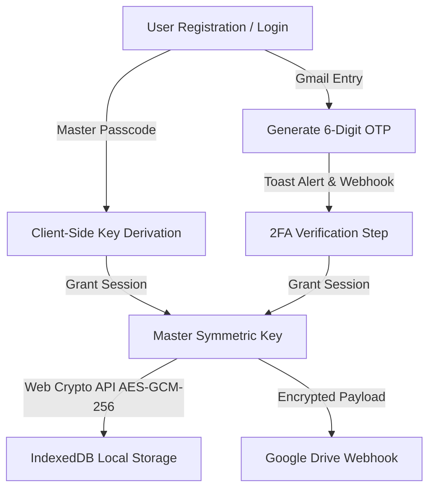

# 🔐 SecureVault PWA

> **A Privacy-First, Zero-Knowledge Encrypted Vault & Task Manager featuring 2-Factor Email OTP Authentication, Client-Side AES-GCM Encryption, Scheduled Task Notifications, and Automated Google Drive Webhook Backups.**


---

## 🌟 Overview

**SecureVault PWA** is a high-security, web-native Progressive Web Application designed for storing confidential notes, passwords, private keys, and scheduled tasks. All data is encrypted locally using the **Web Crypto API (AES-GCM 256-bit)** before persistent storage in IndexedDB. 

Authentication is protected by a deterministic, **$0.00 zero-cost 2-Factor Authentication (2FA Email OTP + Master Passcode)** flow with optional Google Drive Webhook dispatches.

---

## ✨ Key Features

- 🔐 **2-Factor Email OTP Authentication**: Dual-factor security combining your Master Passcode and a 6-digit dynamically generated OTP code sent via browser notifications & optional Webhooks.
- 🛡️ **Zero-Knowledge AES-GCM Encryption**: All note titles, contents, and task items are encrypted on the client side using Web Crypto API. Unencrypted data never leaves your browser.
- 📋 **Encrypted Notes & Sensitive Masking**: Organize notes into custom tags (`Personal`, `Passwords`, `Private Keys`) with one-click sensitive text masking.
- ⏱️ **Scheduled To-Do Deadlines & Alerts**: Set due dates and priorities (`Urgent`, `Important`, `Neutral`, `Someday`) with automatic background notifications.
- ☁️ **Direct Google Drive Webhook Sync**: Backup encrypted vault payloads straight to your personal Google Drive folder using Google Apps Script webhooks.
- 📦 **Offline-First PWA Support**: Fully operational offline powered by Vite PWA service workers and IndexedDB storage.
- 🔒 **Auto-Lock Security**: Automatic session lock whenever tab focus changes or window visibility is lost.
- 📁 **JSON Export & Import**: Easy local encrypted data backup and migration across devices.

---

## 🔒 Security Architecture



### Encryption Protocol
- **Algorithm**: `AES-GCM` with a 256-bit key length.
- **Key Derivation**: `PBKDF2` with `SHA-256` hashing and unique IVs for every record.
- **Data At Rest**: IndexedDB (`secure_vault_db`) stores only base64 ciphertext and IVs.

---

## 🚀 Quickstart & Local Setup

### Prerequisites
- **Node.js** (v18.0.0 or higher)
- **npm** or **yarn**

### Installation

1. **Clone the Repository**:
   ```bash
   git clone https://github.com/kentobi09/gnoted.git
   cd secure-vault-pwa
   ```

2. **Install Dependencies**:
   ```bash
   npm install
   ```

3. **Configure Real Email Delivery (Optional)**:
   Create a `.env` file based on `.env.example`:
   ```env
   PORT=3001
   SMTP_HOST=smtp.gmail.com
   SMTP_PORT=465
   SMTP_SECURE=true
   SMTP_USER=your-email@gmail.com
   SMTP_PASS=your-gmail-app-password
   ```
   *Note: If no SMTP credentials are set, the backend will default to Ethereal Test Mailer and log direct preview links.*

4. **Start Development Server (Frontend + Express Backend)**:
   ```bash
   npm run dev
   ```
   Open your browser at `http://localhost:5173`. Express backend runs on `http://localhost:3001`.

5. **Build Production Bundle**:
   ```bash
   npm run build
   ```

---

## ⚙️ Google Drive Webhook Integration Setup (Optional)

To enable 1-click cloud sync to your own Google Drive:

1. Open [Google Apps Script](https://script.google.com/).
2. Paste the provided Webhook Handler script to receive JSON payloads and save them to a specified folder.
3. Deploy as Web App (`Execute as: Me`, `Who has access: Anyone`).
4. Paste the Webhook URL into SecureVault **Settings ➔ Google Drive Webhook Integration**.

---

## 📄 License

This project is licensed under the **MIT License**.
