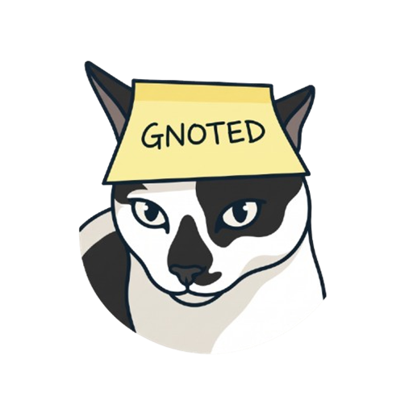

<p align="center">
  
</p>

<h1 align="center">GNOTED</h1>

<p align="center">
  <a href="https://github.com/kentobi09/gnoted/raw/main/GNOTED.apk">
    
  </a>
</p>

<p align="center">
  <a href="https://github.com/kentobi09/gnoted/raw/main/GNOTED.apk"><b>Download GNOTED.apk (Direct Link)</b></a>
</p>

---

## Overview

**GNOTED** is a privacy-first, zero-knowledge encrypted vault and task manager for Android and Web (PWA). Designed for maximum security and high-contrast readability, GNOTED allows you to safely store sensitive notes, passwords, private keys, and scheduled tasks.

All data is encrypted client-side using **AES-GCM 256-bit encryption** before being saved to local storage. Access is protected by a 2-step verification system: a passcode unlock step followed by a stealth secret shape wallpaper challenge requiring a configurable sequence of taps.

---

## Key Features

- **Zero-Knowledge Client-Side Encryption**: Note titles, contents, and tasks are encrypted locally using the Web Crypto API (AES-GCM 256-bit).
- **Google Drive Webhook Automated Sync**: Directly sync encrypted JSON note backups and APK files to your personal Google Drive folder using a zero-cost Google Apps Script Webhook.
- **Secret Shape Pattern Gate**: Customizable verification challenge requiring sequential taps on your secret shape.
- **Auto-Sensitive Masking**: Passwords and Private Keys categories automatically mask content for privacy.
- **Task Deadline Reminders**: Organize tasks with priority levels (Urgent, Important, Neutral, Someday) and due date notification alerts.
- **High-Contrast Dark Theme**: Pitch black backdrop (`#08080A`), dark charcoal containers (`#111216`), crisp white text, and amber yellow highlights (`#F59E0B`).
- **Encrypted Backup Export & Import**: Download and restore encrypted JSON vault backups anytime.

---

## Google Drive Webhook Setup Guide

### Why is a Webhook Needed?

Google Drive API integration typically requires complex OAuth2 authentication flows, client secrets, and dedicated server infrastructure. 

By using a **Google Apps Script Webhook**:
1. **Zero Cost**: Free for all personal `@gmail.com` accounts.
2. **Direct Delivery**: Backup requests travel directly from your device to your personal Google Drive space without intermediate third-party servers.
3. **No OAuth Complexity**: You deploy the script under your own Google account, allowing it to save backups directly into your designated Google Drive folder.

---

### Step-by-Step Webhook Creation

#### Step 1: Open Google Apps Script
Go to [script.google.com](https://script.google.com) and log in with your Google account. Click **New Project**.

#### Step 2: Paste the Apps Script Code
Replace all default code in `Code.gs` with the following snippet (also available in `google_apps_script.js`):

```javascript
function doPost(e) {
  try {
    var contents = e.postData.contents;
    var data = JSON.parse(contents);
    
    var filename = data.filename || ("gnoted_backup_" + new Date().getTime() + ".json");
    var payloadStr = data.payload || "";
    var targetFolderId = data.folderId || "";
    var isBase64 = data.isBase64 || false;
    
    var folder;
    if (targetFolderId && targetFolderId.trim().length > 5) {
      try {
        folder = DriveApp.getFolderById(targetFolderId.trim());
      } catch (err) {
        folder = DriveApp.getRootFolder();
      }
    } else {
      folder = DriveApp.getRootFolder();
    }
    
    var file;
    if (isBase64) {
      var decodedBytes = Utilities.base64Decode(payloadStr);
      var blob = Utilities.newBlob(decodedBytes, "application/vnd.android.package-archive", filename);
      file = folder.createFile(blob);
    } else {
      file = folder.createFile(filename, payloadStr, MimeType.PLAIN_TEXT);
    }
    
    return ContentService
      .createTextOutput(JSON.stringify({ 
        result: "success", 
        fileId: file.getId(), 
        filename: filename, 
        url: file.getUrl() 
      }))
      .setMimeType(ContentService.MimeType.JSON);
  } catch (error) {
    return ContentService
      .createTextOutput(JSON.stringify({ 
        result: "error", 
        message: error.toString() 
      }))
      .setMimeType(ContentService.MimeType.JSON);
  }
}
```

#### Step 3: Deploy as a Web App
1. Click **Deploy** -> **New Deployment** (top right).
2. Click the gear icon next to **Select type** and choose **Web app**.
3. Fill in the deployment details:
   - **Description**: `GNOTED Webhook Sync`
   - **Execute as**: `Me (your-email@gmail.com)`
   - **Who has access**: `Anyone`
4. Click **Deploy**.
5. Grant permissions when prompted (*Click "Advanced" -> "Go to GNOTED Webhook Sync (unsafe)" -> Allow*).

#### Step 4: Add Webhook URL to GNOTED or Upload APK
- **In GNOTED App**: Paste the Webhook URL into **Settings ➔ Google Drive Webhook Integration**.
- **To Upload GNOTED.apk directly to Google Drive**:
  ```bash
  node upload_apk_gdrive.js https://script.google.com/macros/s/.../exec
  ```

---

## Technical Specifications

- **Encryption**: AES-GCM 256-bit symmetric key encryption via Web Crypto API.
- **IV Generation**: Unique 12-byte cryptographically random IV per record.
- **Storage**: IndexedDB (`secure_vault_notes_db`) storing only base64 ciphertext and IVs.

---

## Development & Build

### Installation
```bash
git clone https://github.com/kentobi09/gnoted.git
cd secure-vault-pwa
npm install
```

### Start Dev Server
```bash
npm run dev
```

### Build Production Bundle & Android APK
```bash
npm run build
npx cap sync android
cd android && ./gradlew assembleDebug && cd ..
```

---

## License

This project is licensed under the **MIT License**.
